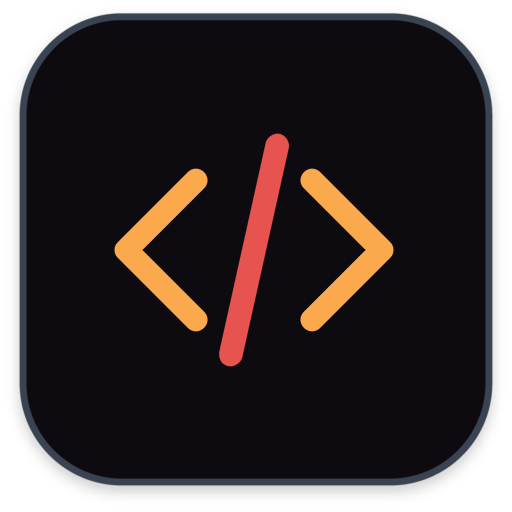

#  3rdparty #

3rdparty library for development and packaging of film and color applications.


## 3rdparty consists of ##

3rdparty is a collection of scripts, configurations, and reference builds designed to simplify compiling third-party libraries on macOS from scratch. It focuses on providing:

* A curated set of libraries, tools, and media assets commonly used in film, color science, and image processing.

* Build scripts and configuration presets that remove the need to understand each individual library’s build system in depth.

* Full control over each dependency, its version, and its configuration flags.

* Up-to-date support for the latest macOS platforms, toolchains, and Xcode releases.

## 3rdparty enables ##

With 3rdparty, you can:

* Build and manage only the libraries you need, with default or custom configurations.

* Reproduce consistent, isolated, and debuggable builds for development or production.

* Test new library versions ahead of official releases or platform adoption.

* Understand and customize the build process rather than relying on binaries.

## 3rdparty is not ##

3rdparty is not a package manager. It does not replace tools like Homebrew or MacPorts.

Instead, it complements them by offering a controlled, transparent, and reproducible build environment for developers who need to understand and influence how their dependencies are built.

It is intended for environments where reproducibility, version control, and configuration transparency matter—such as VFX pipelines, color workflows, and specialized media tools.

## 3rdparty build ##

### Install CMake ###

CMake version > 3.27.0 is required.

```shell
http://www.cmake.org
```

### Build 3rdparty ###
  
3rdparty is built using the ```build.sh``` script, which automates the compilation of all supported dependencies from source, including qt-everywhere-src-6.10.1 for UI/Toolkit support.

To build everything (Qt, libraries, debug and release variants) targeting macOS 12 and newer:

```shell
./build.sh all --target 12
```

Qt will be downloaded and built in ```qt``` and 3rdparty in ```build```. Targets will use the product version as ```CMAKE_OSX_DEPLOYMENT_TARGET``` obtained using ```sw_vers -productVersion``` for compatibility. Build using arguments ```debug``` or ```release``` individually will not clean the build before starting.

```shell
./build.sh debug/release --target 12
```

### Debug Qt with 3rdparty ###

Debugging in Qt with hybrid frameworks make uses of the ```DYLD_IMAGE_SUFFIX``` environment variable. Set it to _debug to force the linker to use the debug version when the framework.

```
DYLD_IMAGE_SUFFIX=_debug
```

### Deploy with 3rdparty ###

Each project is installed with absolute search paths for all names and dependent libraries. The 3rdparty project is not intended for instant deployment but instead requires a deployment step, such as macdeployqt or a similar tool, to correctly configure ```@rpath```, ```@executable_path```, and other runtime application dependencies.

## 3rdparty advanced ##

The 3rdparty project can be built from the top directory by typing 
make. Advanced users can use CMake directly, see CMakeLists.txt.

The build directory contains platform, architecture and debug or 
release versions of projects. After each successful
build binaries, libraries and related files will be installed with
absolute install names.

Each application using the 3rdparty project should have it's own
deployment process to remap install names before distribution.

## CMake configuration ##

Add cmake to path

```shell
export PATH=$PATH:/Applications/CMake.app/Contents/bin
```

## Build configuration ##

Useful make commands

```shell
make                      Build all projects for development and test in 'build/platform'
make debug                Build all projects with debugging symbols when possible.
make clean                Get rid of all the temporary files in 'build/platform'.
make help                 Print all the make options
```

Additionally, a few helpful modifiers

```shell
make verbose=0 ...        Show all compilation commands
make build_libs=1 ...     Build libraries
make build_viewers=1 ...  Build viewers
make build_media=1 ...    Build media
```

## Releases ##

MacOS Tahoe v26.0.1  

Release page:   
https://github.com/mikaelsundell/3rdparty/releases/tag/macOS_Tahoe_v26.0.1

System configuration:   
```
Darwin Kernel Version 25.0.0: Wed Sep 17 21:41:45 PDT 2025; root:xnu-12377.1.9~141/RELEASE_ARM64_T6000 arm64
Apple clang version 17.0.0 (clang-1700.3.19.1)
Target: arm64-apple-darwin25.0.0

Xcode 26.0.1
Build version 17A400
```
Commands used:   
```shell
uname -a
clang --version
xcodebuild -version
```

Note: Earlier macOS builds were not tagged individually; version tagging began with macOS updates starting from v26.0.1.

## Github ##

  * Project  https://github.com/mikaelsundell/3rdparty
  * Issues   https://github.com/mikaelsundell/3rdparty/issues

## Contact ##

Mikael Sundell - mikael.sundell@gmail.com

## License ##

3rdparty packages and their copyrights:

Icon designed using images from Flaticon.com
https://www.flaticon.com/authors/vectaicon

Alembic
Copyright (c) 2013,
Sony Pictures Imageworks Inc. and
Industrial Light & Magic, a division of Lucasfilm Entertainment Company Ltd

Autoconf
Copyright © 1992-1996, 1998-2012 Free Software Foundation, Inc

Automake
Copyright © 1992-1996, 1998-2012 Free Software Foundation, Inc

Boost
Copyright Beman Dawes, David Abrahams, 1998-2005
Copyright Rene Rivera 2004-2007

bzip2 Copyright 
Copyright © 1996-2007 Julian Seward

CMake
Copyright 2006-2010 Kitware, Inc
Copyright 2006 Alexander Neundorf <neundorf@kde.org>

Draco
Copyright 2019 The Draco Authors

FFmpeg
Copyright (c) Fabrice Bellard

Freetype
David Turner, Robert Wilhelm, and Werner Lemberg

Gettext
Copyright © 1992-1996, 1998-2012 Free Software Foundation, Inc

Giflib
Copyright (c) 1997 Eric S. Raymond

GLEW
Copyright (C) 2002-2007, Milan Ikits <milan ikits[]ieee org>
Copyright (C) 2002-2007, Marcelo E. Magallon <mmagallo[]debian org>
Copyright (C) 2002, Lev Povalahev

GLM
Copyright (c) 2005 - 2013 G-Truc Creation

Harfbuzz
Copyright © 2018  Google, Inc.

Imath
Copyright (c) 2002, Industrial Light & Magic, a division of Lucas Digital Ltd. LLC

Jasper
Copyright (c) 2001-2006 Michael David Adams
Copyright (c) 1999-2000 Image Power, Inc
Copyright (c) 1999-2000 The University of British Columbia

Jpeg
Copyright (C) 1991-1997, Thomas G. Lane

GTest
Copyright 2005, Google Inc

HDF5
Copyright by The HDF Group.
Copyright by the Board of Trustees of the University of Illinois
All rights reserved. 

Ilmbase
Copyright (c) 2002, Industrial Light & Magic, a division of Lucas Digital Ltd. LLC

Json
Licensed under the MIT License <http://opensource.org/licenses/MIT>.
SPDX-License-Identifier: MIT
Copyright (c) 2013-2022 Niels Lohmann <http://nlohmann.me>.

Lcms2
Copyright (c) 1998-2012 Marti Maria Saguer

Libjpeg-turbo
Copyright (C) 1994-1997, Thomas G. Lane
Modified 2019 by Guido Vollbeding

Libpng
Copyright (c) 1998-2009 Glenn Randers-Pehrson
(Version 0.96 Copyright (c) 1996, 1997 Andreas Dilger)
(Version 0.88 Copyright (c) 1995, 1996 Guy Eric Schalnat, Group 42, Inc.)

Libtool
Copyright © 1992-1996, 1998-2012 Free Software Foundation, Inc

LibWebp
Copyright 2010 Google Inc. All Rights Reserved

LLVM
Copyright (C) 2022 The llvm project

MaterialX
TM & (c) 2017 Lucasfilm Entertainment Company Ltd. and Lucasfilm Ltd.

NanoGUI
NanoGUI was developed by Wenzel Jakob <wenzel.jakob@epfl.ch>.

Nasm
1996-2017 The NASM Authors

Ninja
Copyright 2011 Google Inc. All Rights Reserved.

OCIO
Copyright (c) 2003-2010 Sony Pictures Imageworks Inc., et al

OIIO
Copyright 2008 Larry Gritz and the other authors and contributors.
All Rights Reserved.

OneTBB
Copyright (c) 2005-2021 Intel Corporation

OpenEXR
Copyright (c) 2002, Industrial Light & Magic, a division of Lucas Digital Ltd. LLC

OpenJPEG
Copyright (c) 2002-2014, Universite catholique de Louvain (UCL), Belgium
Copyright (c) 2002-2014, Professor Benoit Macq
Copyright (c) 2010-2011, Kaori Hagihara

OpenCV
Copyright © 2024 , OpenCV team

OpenSubDiv
Copyright 2022 Pixar

OpenUSD
Copyright 2022 Pixar

Pcre2
Original API code Copyright (c) 1997-2012 University of Cambridge
New API code Copyright (c) 2016-2020 University of Cambridge

PTex
Copyright 2014 Disney Enterprises, Inc.  All rights reserved

Pybind
Copyright (c) 2016 Wenzel Jakob <wenzel.jakob@epfl.ch>, All rights reserved

Pyside2
Copyright (C) 2020 The Qt Company Ltd

Pyside2-tools
Copyright (C) 2020 The Qt Company Ltd

Qt
Copyright (C) 2020 The Qt Company Ltd

Tclap
Copyright (c) 2018 Google LLC
All rights reserved

Tiff
Copyright (c) 1988-1997 Sam Leffler
Copyright (c) 1991-1997 Silicon Graphics, Inc.

x264 Copyright
Copyright (C) 2003-2013 x264 project

yasm Copyright
Copyright (c) 2001-2007 Peter Johnson

Zlib Copyright
Copyright (C) 1995-2004 Jean-loup Gailly.